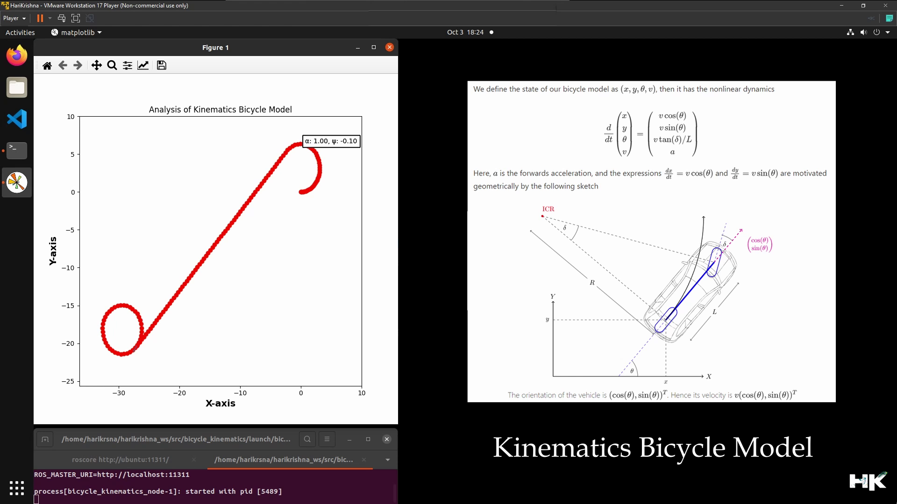

# Bicycle Kinematics Model

  

---------------------------------------------

## About this Project:
The project merges the domains of robotics and autonomous vehicles by exploring the kinematics of a bicycle model, a common method for simulating the movement and steering dynamics of cars. Utilizing ROS allows for the integration of this model within a larger robotic system or autonomous vehicle architecture. Python is employed for scripting the kinematics, while matplotlib is used to visualize the results, which is critical for developing and testing self-driving car algorithms.

---------------------------------------------

## What is Kinematics Bicycle Model:
The Bicycle Kinematic Model block creates a bicycle vehicle model to simulate simplified `car-like vehicle dynamics`. This model represents a vehicle with two axles defined by the length between the axles, Wheel base. The front wheel can be turned with steering angle `psi`. The vehicle heading theta is defined at the center of the rear axle. It is is a simplified representation of a vehicle or robot's motion used extensively in robotics and autonomous systems. It captures the essential dynamics of steering and movement, assuming that the ***vehicle's front and rear wheels are replaced by a single wheel each at the centerline of the vehicle*** .By considering the geometry and physical constraints of the system, such as the wheelbase and steering limits, the kinematic bicycle model predicts the path that a robot or vehicle will take, given certain steering inputs. 

---------------------------------------------

## Project Observations:

The image displays a computer screen showing two key aspects of the kinematics bicycle model: a plot and a set of equations with a geometric diagram. On the left, a matplotlib graph illustrates the trajectory analysis of the model, where the red dots likely represent the path taken by a simulated vehicle or robot over time, given certain steering and velocity inputs. 

On the right, the screenshot contains the mathematical formulation of the model, detailing the state of the bicycle model as a set of variables—position `(x, y)` orientation `(θ)` and velocity `(v)`. It outlines the non-linear differential equations that govern the system's dynamics, including the forward acceleration 'a' and the change in orientation over time, as a function of the vehicle's velocity and the steering angle `(δ)` with `L` representing the wheelbase.

The geometric diagram complements these equations, visually depicting the `instantaneous center of rotation (ICR)` and the vehicle's orientation and velocity vectors. This integration of mathematical and visual tools is essential for understanding and controlling the motion of autonomous vehicles in robotics.

### Observation 1

  

### Observation 2
    

  

### Observation 3

  

---------------------------------------------

## Result and Analysis: Mathematical Predictions

The image below a `structured analysis of a kinematic bicycle model` with a focus on the mathematical predictions and their practical applications. On the left, **a table enumerates various control sequences applied to a simulated vehicle or robot, detailing the initial and final positions, along with the distance traveled.** These control sequences are vectors that likely represent a combination of `velocity`, `steering angle`, and `time duration`. The table is used to track the outcomes of different inputs, **demonstrating how changes in the control sequence affect the final position and the total distance traveled.**

On the right, the image outlines a three-step process used to solve the kinematic bicycle model equations. 

• Step 1 involves setting a constant `velocity`.  
• Step 2 deals with the `rate of change of heading` (turning rate).  
• Step 3 involves calculating the change in the `X and Y positions over time`. The steps include formulas that take into account the vehicle's velocity, the turning rate, and the time duration to integrate these values and determine the new position.  
• The process culminates in the calculation of the final position coordinates and the Euclidean distance traveled from the origin, providing a clear link between theoretical models and real-world trajectory outcomes.  

---------------------------------------------

## My Project Video Demonstration:

  
  

---------------------------------------------
